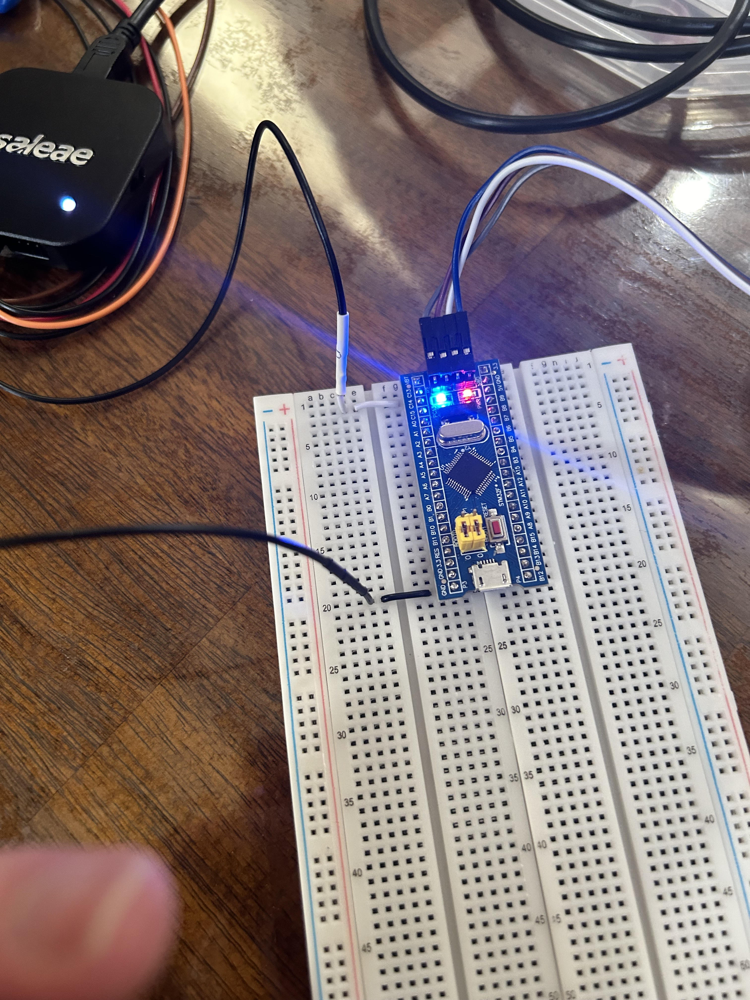
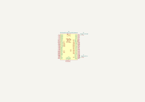
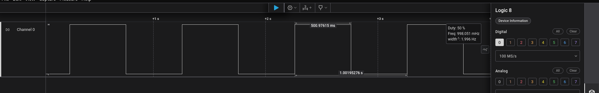

# Blinky
## Introduction
This project blinks the USR-LED connected to pin PC13 at a frequency of 1 Hz. The purpose of this simple project was to familiarize myself with the IDE and hardware.

The program begins by initializing the internal timers and pin PC13 as a GPIO output. The pin is then set and reset at a frequency of 1 Hz. The setting and resetting of the pin turns the onboard LED on and off respectively.

To compile and flash the program to the chip, I used the 'Run' option in STM32CubeIDE. To connect the board to the computer I used an ST-Link/V2.

## Hardware Used
This project utilizes a STM32F103C8T6.

## Timer Configuration
Unless otherwise specified, this section contains the default hardware timer configuration used.

- HSE = Crystal/Ceramic Resonator
- Input Frequency = 8 MHz
- PLL Src Mux = HSE
- System Clk Mux = PLLCLK
- HCLK = 72 MHz

## Other Tools
Saleae Logic 2 logic analyzer and associated software used to verify frequency.

## Project Setup
Below is the pin connections I used.

| Logic Analyzer | STM32F103C8T6 |
| --- | ------------- |
| D0 In | PA13 |
| D0 GND | GND |

The wire color codes are listed in the table below.

| Color | Signal |
| --- | ------------- |
| White | GPIO Output |
| Black | GND |

Setup: 

## Schematic

Schematic: 

## Images
Below are images of the project setup and frequency verification.

Frequency Verification: 