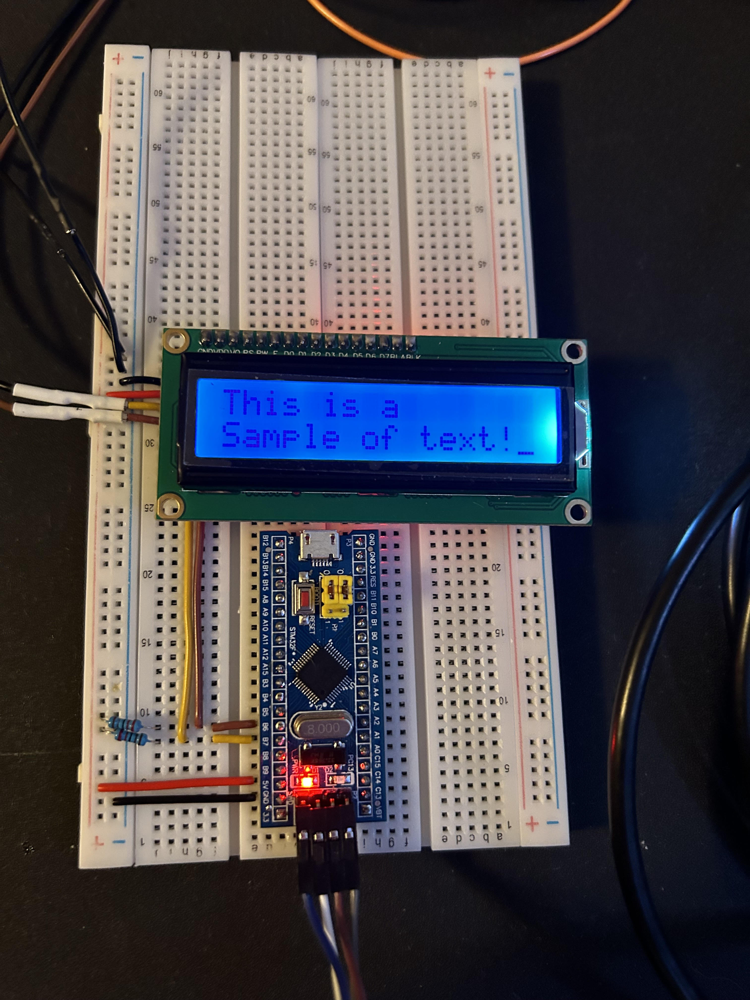

# Crystal-LCD
## Introduction
This project runs a sample program that prints sample text and an alternating patteren to a 1602-LCD via I2C communication Protocol.

The process begins by initializing the internal clock and clock for the pins used for the I2C bus. I2C bus hi2c1 is then initialized. Finally, the display is initialized in accordance with the [manual](https://cdn-shop.adafruit.com/datasheets/TC1602A-01T.pdf). Upon completion of initialization, the sample program runs in a super loop.

To accommodate the I2C interface for the LCD, each byte of data is sent 4 bits at a time. This requires bit manipulation in the lcd_send_cmd_hi2cx and lcd_send_data_hi2cx functions.

To compile and flash the program to the chip, I used the 'Run' option in STM32CubeIDE. To connect the board to the computer I used an ST-Link/V2.

## Hardware Used
This project utilizes a STM32F103C8T6.

## Timer Configuration
Unless otherwise specified, this section contains the default hardware timer configuration used.

- HSE = Crystal/Ceramic Resonator
- Input Frequency = 8 MHz
- PLL Src Mux = HSE
- System Clk Mux = PLLCLK
- HCLK = 72 MHz

## Custom Driver
For this project I wrote a custom driver for the LCD (i2c-lcd.h). The functions and a brief description of their use are described below. The hi2c1 and or hi2c2 bus must be initialized before calling these functions.

void lcd_init_hi2c1(uint16_t addr)\
	- Initializes the LCD at address on i2c bus hi2c1

void lcd_init_hi2c2(uint16_t addr)\
	- Initializes the LCD at address on i2c bus hi2c2

void lcd_send_cmd_hi2c1(uint16_t addr, char cmd)\
	- Send command to the LCD at address on i2c bus hi2c1. Commands are defined in lcd-commands.h

void lcd_send_cmd_hi2c2(uint16_t addr, char cmd)\
	- Send command to the LCD at address on i2c bus hi2c2. Commands are defined in lcd-commands.h

void lcd_send_data_hi2c1(uint16_t addr, char data)\
	- Send data to the LCD at address addr on i2c bus hi2c1

void lcd_send_data_hi2c2(uint16_t addr, char data)\
	- Send data to the LCD at address addr on i2c bus hi2c2

void lcd_send_string_hi2c1(uint16_t addr, char \*str)\
	- Send string to the LCD at address addr on i2c bus hi2c1 

void lcd_send_string_hi2c2(uint16_t addr, char \*str)\
	- Send string to the LCD at address addr on i2c bus hi2c2

void lcd_put_cur_hi2c1(uint16_t addr, int row, int col)\
	- Move cursor to specified row, range [0, 1], and column, range [0, 15], for LCD at address on hi2c1 bus

void lcd_put_cur_hi2c2(uint16_t addr, int row, int col)\
	- Move cursor to specified row, range [0, 1], and column, range [0, 15], for LCD at address on hi2c2 bus

void lcd_clear_hi2c1(uint16_t addr)\
	- Clear display for LCD at address on hi2c1 bus

void lcd_clear_hi2c2(uint16_t addr)\
	- Clear display for LCD at address on hi2c1 bus

## Communication
Since the I2C backpack interacts with the LCD in 4-bit interface, commands and data must be sent one nibble at a time. The initaial byte to be sent is first split into two bytes where the most significant nibble is either the upper or lower four bits of the original byte. The connections between the LCD I2C backpack and the LCD are given in the below table.

| I2C Backpack | LCD | 
| ------------ | --- |
| P7 | D7 |
| P6 | D6 |
| P5 | D5 |
| P4 | D4 |
| P3 | Backlight (BL) |
| P2 | EN |
| P1 | R/W |
| P0 | R/S |

To copy the upper nibble of the original data byte into a byte to be sent to the LCD (referred to as the upper byte), the original data byte is compared to the value 0xF0 (11110000) with a bitwise AND operation. To copy the lower nibble of the original data byte into a byte to be sent to the LCD (referred to as the lower byte), the original byte is left bit shifted 4 times and compared to the value 0xF0 (11110000) with a bitwise AND operation. 

To send the upper and lower bytes, the EN pin must be set to high then to low for both of the two bytes created above.

The byte received by the LCD is determined to be either a command (clearing the screen, returning the cursor home, etc.) or data (character to be printed) by whether the R/S pin is set to high. If the R/S pin is low, the byte is treated as a command. If the R/S pin is high, the byte is treated as data. 

To complete all this, an array of 4 bytes is created. The first byte in the array contains the upper half of the initial byte to be sent, the E/N pin bit set to high, and the status of the R/S pin is set depending on if the byte to be sent is a command or data. The second byte is the same as the first except the en pin bit is set to low. Bytes three and four follow the same process but for the byte containing the lower half of the initial bit to be sent.

The below table shows the structure of the byte array to sen to the LCD to send a command. The original data bits are represented by BX where X is the original bit location. The corresponding LCD pins to the bit location are given in the header.

| Index | D7 | D6 | D5 | D4 | BL | EN | R/W | R/S |
| :-: | -- | -- | -- | -- | -- | -- | --- | --- |
| 0 | B7 | B6 | B5 | B4 | 1 | 1 | 0 | 0 |
| 1 | B7 | B6 | B5 | B4 | 1 | 0 | 0 | 0 |
| 2 | B3 | B2 | B1 | B0 | 1 | 1 | 0 | 0 |
| 3 | B3 | B2 | B1 | B0 | 1 | 0 | 0 | 0 |

The below table shows the structure of the byte array to sen to the LCD to send data, such as a character. The original data bits are represented by BX where X is the original bit location. The corresponding LCD pins to the bit location are given in the header.

| Index | D7 | D6 | D5 | D4 | BL | EN | R/W | R/S |
| :-: | -- | -- | -- | -- | -- | -- | --- | --- |
| 0 | B7 | B6 | B5 | B4 | 1 | 1 | 0 | 1 |
| 1 | B7 | B6 | B5 | B4 | 1 | 0 | 0 | 1 |
| 2 | B3 | B2 | B1 | B0 | 1 | 1 | 0 | 1 |
| 3 | B3 | B2 | B1 | B0 | 1 | 0 | 0 | 1 |

## Other Tools
Saleae Logic 2 logic analyzer and associated software used to verify correct bytes being sent.

## Project Setup
Below is the pin connections I used.

| LCD | STM32F103C8T6 |
| --- | ------------- |
| GND | GND |
| VCC | 5V |
| SDA | PB7 |
| SCL | PB6 |

| Logic Analyzer | STM32F103C8T6 |
| --- | ------------- |
| D0 In | PB7 |
| D0 GND | GND |
| D1 In | PB6 |
| D1 GND | GND |

A 4K7 ohm pull-up resistor is installed between both the SDA and SCL buses and 5V.

The wire color codes are listed in the table below.

| Color | Signal |
| --- | ------------- |
| Red | 5V |
| Black | GND |
| Yellow | SDA |
| Brown | SCL |

Setup: 

## I2C Setup
- Address length = 7-bit
- Default settings for all other options

## Schematic

Schematic: 

## Images

Initial Initialization Command (0x30): 

Sending 'T' Character (0x54): 

Sending Black Square Character (0xFF): 