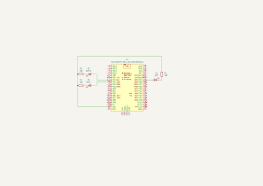
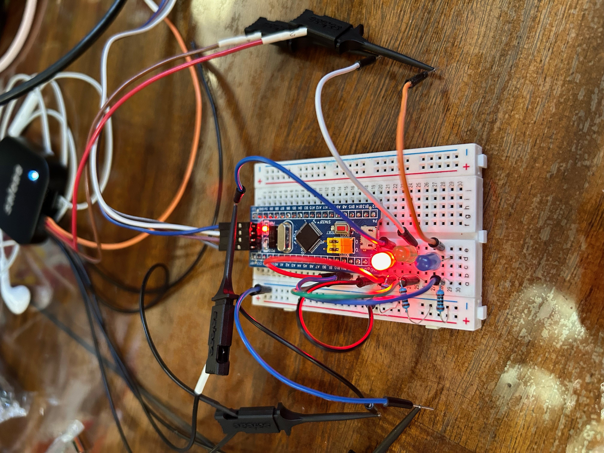
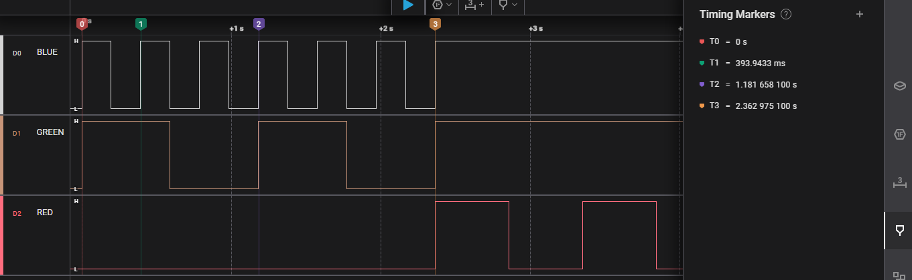

# FreeRTOS-Blinky
## Introduction 
The purpose of this project is to practice creating and terminating tasks using CMSIS-RTOS. 

This project begins by creating three tasks. BlueBlinkTask is responsible for blinking the Blue LED at a frequency of 2.5 Hz. GreenBlinkTask is responsible for blinking the Green LED at a frequency of approximately 0.83 Hz. RedBlinkTask has two responsibilities. The first responsibility is to terminate the the other two tasks after a delay of 2.4 seconds. The task then blinks the red LED at a frequency of 1 Hz.

## Other Tools
Saleae Logic 2 logic analyzer and associated software used to verify frequency and order of events.

## CMSIS Setup
- Default settings for all options.

## Project Setup
Below is the pin connections I used.

| Red LED | STM32F103C8T6 |
| ------- | ------------- |
| Positive | PB1 |
| GND | GND |

| Green LED | STM32F103C8T6 |
| ------- | ------------- |
| Positive | PA10 |
| GND | GND |

| Blue LED | STM32F103C8T6 |
| ------- | ------------- |
| Positive | PA11 |
| GND | GND |

| Logic Analyzer | STM32F103C8T6 |
| --- | ------------- |
| D0 In | PB1 |
| D0 GND | GND |
| D1 In | PA10 |
| D1 GND | GND |
| D2 In | PA11 |
| D2 GND | GND |

A 100 ohm resistor is installed on the GND of each LED.

## Schematic

Schematic: 

## Images

Setup: 

Order and Frequency Verification. Channels 0, 1, and 2 correspond to the red, green and blue LED's respectively: 