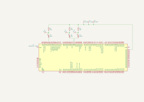

# FreeRTOS-Blinky
## Introduction 
This project uses a one shot timer to terminate two tasks and start a third.

This project begins by creating two tasks. BlueBlinkTask is responsible for blinking the Blue LED at a frequency of 2.5 Hz. GreenBlinkTask is responsible for blinking the Green LED at a frequency of approximately 0.83 Hz. A one shot timer is then created that is initialized to run for 2.4 seconds. 

When the timer completes, the initial two tasks are terminated with the blue and green LED's toggled high and a new task is created that blinks the red LED at frequency of 1 Hz. The timer callback that occurs upon timer completion and the toggling of the green and blue led's to high all occur at the same moment in time but the tasks that control the blue and green LED's have a higher priority than the timer callback so they run first.

## Hardware Used
This project utilizes a STM32F767ZI.

## Timer Configuration
Unless otherwise specified, this section contains the default hardware timer configuration used.

- HSI RC = 16 MHz
- PLL Src Mux = HSI
- System Clk Mux = PLLCLK
- HCLK = 216 MHz

## Other Tools
Saleae Logic 2 logic analyzer and associated software used to verify frequency and order of events. SEGGER Ozone used for debugging running tasks.

## CMSIS Setup
- Default settings for all options.

## Project Setup
Below is the pin connections I used.

| Red LED | STM32F67ZI |
| ------- | ------------- |
| Positive | PB8 |
| GND | GND |

| Green LED | STM32F67ZI |
| ------- | ------------- |
| Positive | PB9 |
| GND | GND |

| Blue LED | STM32F67ZI |
| ------- | ------------- |
| Positive | PA5 |
| GND | GND |

| Logic Analyzer | STM32F67ZI |
| --- | ------------- |
| D0 In | PA5 |
| D0 GND | GND |
| D1 In | PB9 |
| D1 GND | GND |
| D2 In | PB8 |
| D2 GND | GND |

A 100 ohm resistor is installed on the GND of each LED.

The wire color codes are listed in the table below.

| Color | Signal |
| --- | --- |
| Black | GND |
| Blue | PA5 GPIO Output |
| Green | PB9 GPIO Output |
| White | PB8 GPIO Output |

Setup: 

## Schematic

Schematic: 

## Images

Order and Frequency Verification. Channels 0, 1, and 2 correspond to the blue, green and red LED's respectively. Timing masurements are included on the right side of image: 

Ozone task and stack view when timer is complete. Timer Callback added to callstack: 

Ozone task and stack view after timer callback terminates blue and green tasks: 

Ozone task and stack view after timer starts red task: 

Ozone task and stack view after red task begins: 

Ozone task and stack view after timer is suspended: 