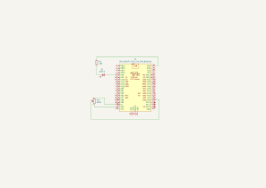
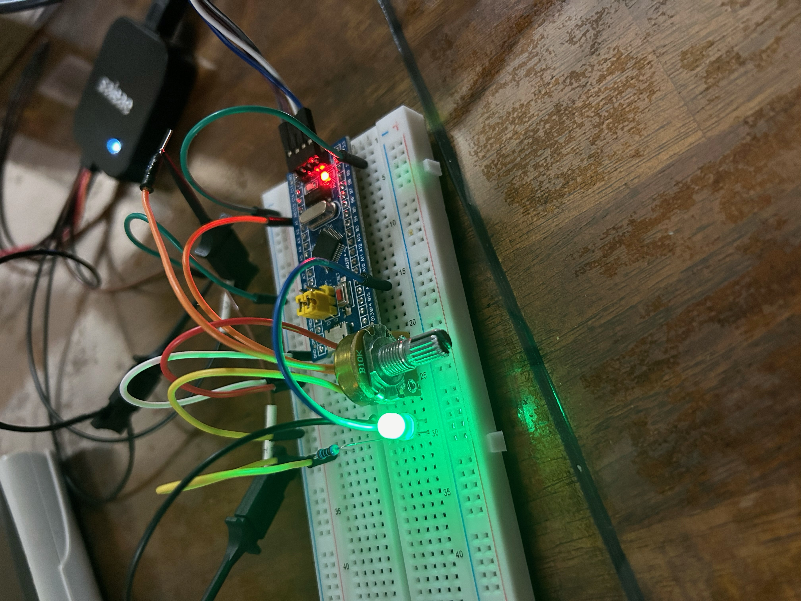
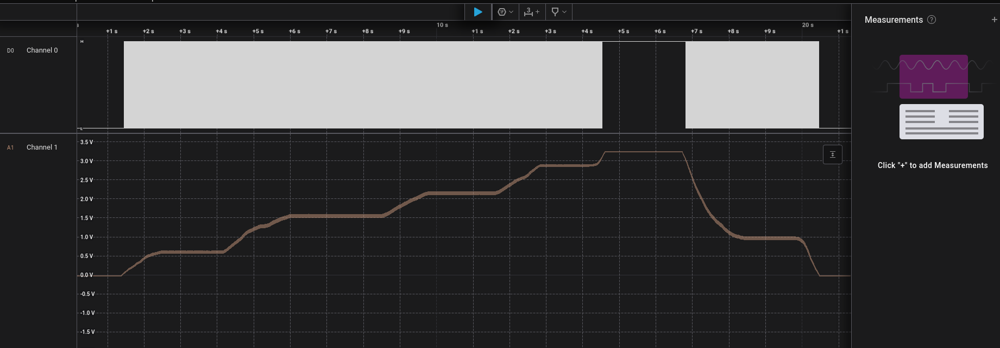
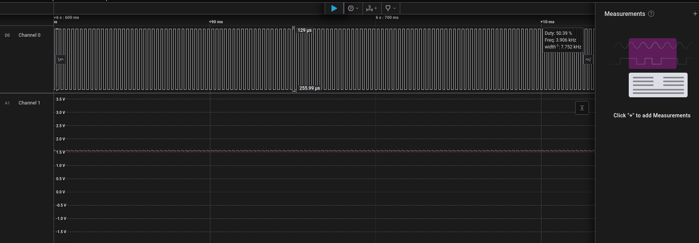

# ADC-DMA-LED-Dimmer
## Introduction
This project takes analog data generated by a potentiometer then generates a corresponding PWM signal to dim an LED. 

The program begins by initializing timers and peripherals. The PWM driver and ADC drivers are then initialized and started. Finally, the scheduler is initialized, a task to control the LED is created, and the scheduler is started.

As the ADC pin receives data, the data is stored in a buffer. When the buffer is full, a DMA interrupt is generated which stops the collection of data and releases the ADC Semaphore. The LED control task then acquires this semaphore and processes the buffer, updating the value in the CCR. Ads the value in the CCR changes, the duty cycle of the PWM signal used to drive the LED changes and the LED's brightness changes. Once the buffer has been processed, the LED control task releases the semaphore which is then acquired by the interrupt function allowing the interrupt to complete and data collection to resume.

By using DMA, the associated DMA interrupt, and a binary semaphore the load on the microcontroller and the overall power consumption is reduced in comparison to going directly from ADC to the LED control task or polling for ADC data and using a queue.

## CMSIS-RTOS Settings
- All default settings
- Binary semaphore used for the LED control task

## TIM Settings
- Prescaler = 72 - 1 (subtract 1 since register adds 1)
- ARR = 256 - 1
- Resulting frequency is 3.906 kHz
- All other values default 

## Other Tools
Saleae Logic 2 logic analyzer and associated software used to verify PWM duty cycle value responded properly to changes in analog signal.

## Project Setup
Below is the pin connections I used.

| Green LED | STM32F103C8T6 |
| ------- | ------------- |
| Positive | PA8 |
| GND | GND |

| Potentiometer | STM32F103C8T6 |
| ------- | ------------- |
| Pin 1 | GND |
| Pin 2 | PA0 |
| Pin 3 | 5V |

| Logic Analyzer | STM32F103C8T6 |
| --- | ------------- |
| D0 In | PA8 |
| D0 GND | GND |
| A1 In | PA0 |
| A1 GND | GND |

A 100 ohm resistor is installed on the GND of the LED.

## Schematic

Schematic: 

## Images
Below are images of the project setup and response verification.

Setup: 

Response Verification. PWM Signal and Analog signal are channels 0 and 1 respectively: 

PWM Signal Verification. PWM Signal and Analog signal are channels 0 and 1 respectively: 