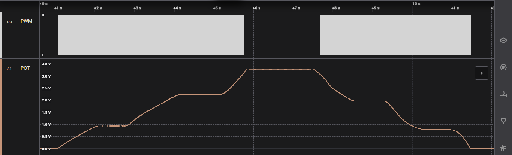
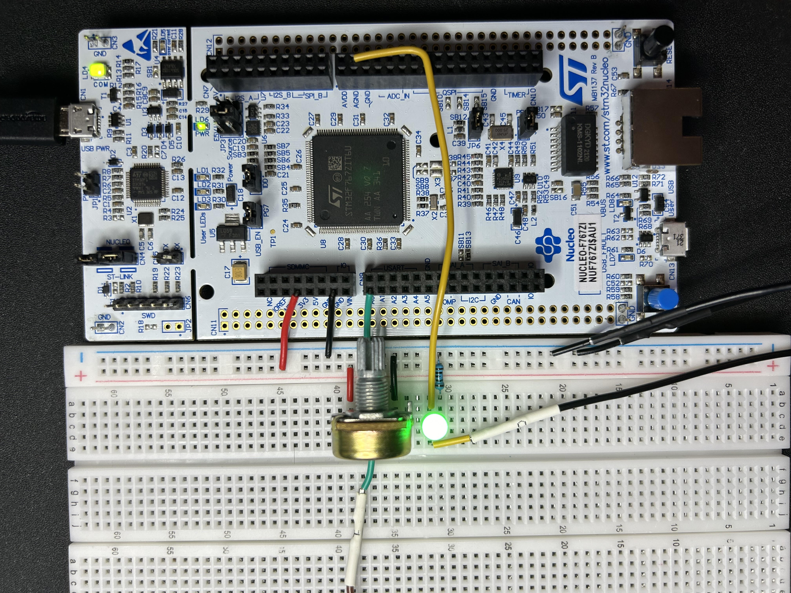

# ADC-DMA-LED-Dimmer
## Introduction
This project takes analog data generated by a potentiometer and stores it directly to a buffer that is processed to generate a PWM signal that drives a LED.

The program begins by initializing timers and peripherals. The PWM driver and ADC drivers are then initialized and started. Finally, the scheduler is initialized, a task to control the LED is created, and the scheduler is started.

As the ADC pin receives data which is stored directly in a buffer. When the buffer is full, a DMA interrupt is generated which stops the collection of data and releases the ADC Semaphore. The LED control task then acquires this semaphore and processes the buffer, updating the value in the CCR. As the value in the CCR changes, the duty cycle of the PWM signal used to drive the LED changes and the LED's brightness changes. Once the buffer has been processed, the LED control task resumes the collection of ADC data.

By using DMA, the associated DMA interrupt, and a binary semaphore the load on the microcontroller the overall power consumption is reduced in comparison to going directly from ADC to the LED control task or polling for ADC data and using a queue. The processing speed of the STM32F767 is enough to make the gap between data collection and PWN negligible.

## Hardware Used
This project utilizes a STM32F767ZI.

## Timer Configuration
Unless otherwise specified, this section contains the default hardware timer configuration used.

- HSI RC = 16 MHz
- PLL Src Mux = HSI
- System Clk Mux = PLLCLK
- HCLK = 216 MHz

## CMSIS-RTOS Settings
- All default settings
- Binary semaphore used for the LED control task

## TIM Settings
- Prescaler = 216 - 1 (subtract 1 since register adds 1)
- ARR = 256 - 1
- Resulting frequency is expected to be 3.906 kHz
- All other values default 

## DMA Settings
- DMA2 Stream 0
- Circular Mode
- Data width of word for Peripheral and memory
- Memory address increment

## Other Tools
Saleae Logic 2 logic analyzer and associated software used to verify PWM duty cycle value responded properly to changes in analog signal. Seger Ozone used to debug task and view contents of buffer. 

## PWM Description
A PWM signal is a digital signal sent at high frequency where the signal is high for only a fraction of each period of the signal. The ratio of how long the signal is high to the total perios length is the duty cycle. The greater the duty cycle, the more power delivered each period. In this example, this can be seen in how the brightness of the LED changes.

As the analog signal changes, the duty cycle of the LED, and therefore brightness, changes. In the picture below, tha anlalog signal starts at 0V then increases to Vref (3.286V) then back to 0V. The PWM signal responds as expected, starting out at 0% then climbing to 100% then back to 0% in response.

This calculation can be verified using the numbers below. The product of the duty cycle and the reference voltage should be approximately the voltage given on the ADC signal.

## Project Setup
Below is the pin connections I used.

| Green LED | STM32F103C8T6 |
| ------- | ------------- |
| Positive | PE9 |
| GND | GND |

| Potentiometer | STM32F103C8T6 |
| ------- | ------------- |
| Pin 1 | GND |
| Pin 2 | PA3 |
| Pin 3 | 3.3V |

| Logic Analyzer | STM32F103C8T6 |
| --- | ------------- |
| D0 In | PE9 |
| D0 GND | GND |
| A1 In | PA3 |
| A1 GND | GND |

A 100 ohm resistor is installed on the GND of the LED.

Setup: 

## Schematic

Schematic: 

# Images

ADC Buffer when ADC is 0: 

ADC Buffer when ADC is 0 before processing: 

ADC Buffer when ADC is 0 after processing: 

ADC Buffer when potentiometer in approximately the middle position: 

ADC Buffer when potentiometer in max position: 