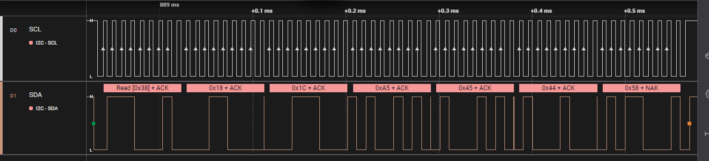

# Temperature-Humidity-Sensor-And-Display-I2C
## Introduction
This project takes temperature and humidity readings obtained from an AHT10 sensor and displays them on a crystal LCD. Both the AHT10 sensor and LCD are on the same I2C bus.

The program begins by initializing peripherals and the OS scheduler then starts 2 tasks: one fo the LCD and one for the AHT10 sensor.

The AHT10 task retrieves data from the AHT10 sensor via the I2C bus. The temperature, humidity, and units for the temperature are used to populate a dataPAcket struct which is added to  a queue for processing. The LCD task takes items from the queue and processes them. The temperature and humidity are displayed on the LCD screen and update if the values change between read cycles.

A queue is used to pass data between the 2 tasks. This is used since the HAL has functions for adding and retrieving data to the queue thaat include blocking the current task if the queue iss full or empty respectively.

## Hardware Used
This project utilizes a STM32F767ZI.

## Custom Drivers
A custom driver for the AHT10 sensor and LCD1602 display was used. The drivers code, information, and peripheral information can be found [here](https://github.com/joshuawalker3/STM32-Drivers).

## Timer Configuration
Unless otherwise specified, this section contains the default hardware timer configuration used.

- HSI RC = 16 MHz
- PLL Src Mux = HSI
- System Clk Mux = PLLCLK
- HCLK = 216 MHz

## CMSIS-RTOS Settings
- All default settings

## Other Tools
Saleae Logic 2 logic analyzer and associated software used to verify data sent via I2C bus. Seger Ozone used to debug task and view contents of buffer. 

## Project Setup
Below is the pin connections I used.

| LCD1602 | STM32F767ZI |
| ------- | ------------- |
| VCC | PE9 |
| GND | GND |
| SDA | PF0 |
| SCL | PF1 |

| AHT10 | STM32F767ZI |
| ------- | ------------- |
| VCC | PF2 |
| GND | GND |
| SDA | PF0 |
| SCL | PF1 |

| Logic Analyzer | STM32F767ZI |
| --- | ------------- |
| D0 In | PE9 |
| D0 GND | GND |
| A1 In | PA3 |
| A1 GND | GND |

A 2K ohm resistor is used as a pullup for the I2C Bus.

Setup: 

## Schematic

Schematic: 

# Images

Mesurement request for AHT10: 

Reading data from AHT10 and showing the known issue of thes sensor not releasing the I2C bus after retrieving data, requiring the sensor to be powered off between reads: 

Writing data to LCD: 