# Projects Using STM32F103C8T6 Microcontroller

## Overview
This repository contains a collection of projects for the STM32F103C8T6 microcontroller. The projects are meant to showcase my abilities and understanding of both the hardaware and software associated with embedded programming with STM32 microcontrollers.

RTOS Skills Used
- Task creation/termination
- Semaphores

Signal Types Used
- GPIO
- PWM
- ADC

Communication Protocols Used
- I2C

Interprocess Communication Methods Used
- DMA

Tools used
- [Oscilloscope](http://www.hanmatek.cn/en/index.php?s=/Show/index/cid/14/id/39.html)
- [Logic Analyzer](https://www.saleae.com/products/saleae-logic-8)

Software used
- [Saleae Logic 2](https://www.saleae.com/pages/downloads)
- [Kicad](https://www.kicad.org/) (for schematics)

## General Software Used
Applications were written using the STM32CubeIDE environement and the automatically generated STM32 HAL was utilized.
When other software or API's are used (i.e. CSMIS-RTOS) they will be listed in the projects software section.

## General Hardware Used
Each project is built for the STM32F103C8T6 microcontroller mounted on a "blue pill". When other hardware and tools
are used (i.e. oscilloscope) they will in the projects hardware section. 

## Default Timer Configurations
Unless otherwise specified, this section contains the default hardware timer configuration used.

- HSE = Crystal/Ceramic Resonator
- Input Frequency = 8 MHz
- PLL Src Mux = HSE
- System Clk Mux = PLLCLK
- HCLK = 72 MHz

# Projects

## adc-dma-led-dimmer
### Overview
This project takes analog data from a potentiometer then generates a corresponding PWM signal to dim an LED. The analog data is converted to a digital value and these values are stored in a buffer. When the buffer is full, an interrupt is generated which releases a semaphore. The LED control task acquires this semaphore and processes the buffer via DMA. The values in the buffer are used to update the CCR to change the duty cycle of the PWM signal used to drive the LED.

### CMSIS-RTOS Settings
- All default settings

### TIM Settings
- Prescaler = 72 - 1 (subtract 1 since register adds 1)
- ARR = 256 - 1
- Resulting frequency is 3.906 kHz
- All other values default 

### Software
Saleae Logic 2 software used.

### Hardware
Logic analyzer used to verify response. Oscilloscope used for quick debugging of PWM signals.

### Schematic

Schematic: 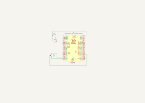

### Images
Below are images of the project setup and response verification.

Setup: 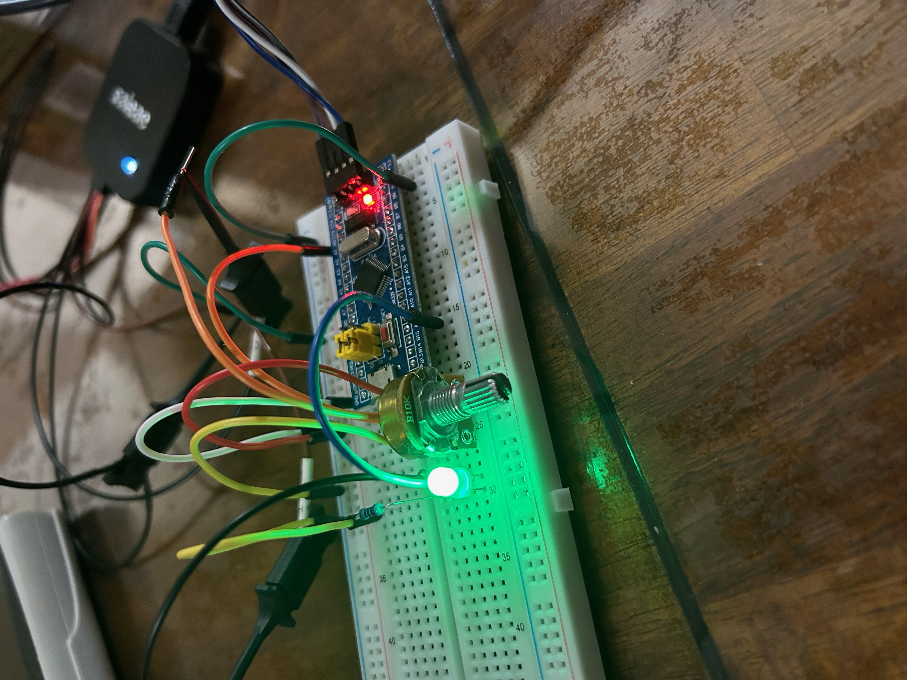

Response Verification. PWM Signal and Analog signal are channels 0 and 1 respectively: 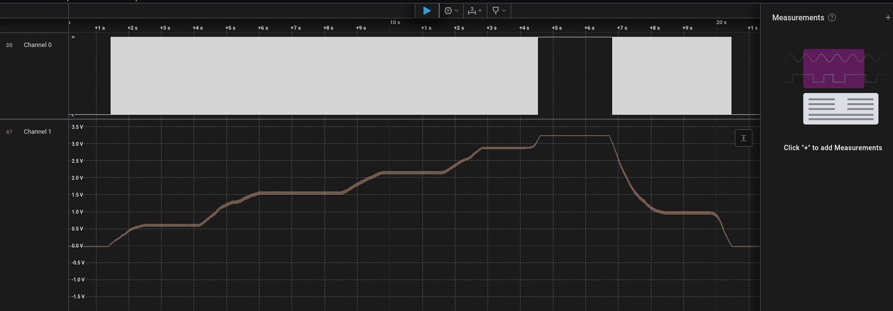

PWM Signal Verification. PWM Signal and Analog signal are channels 0 and 1 respectively: 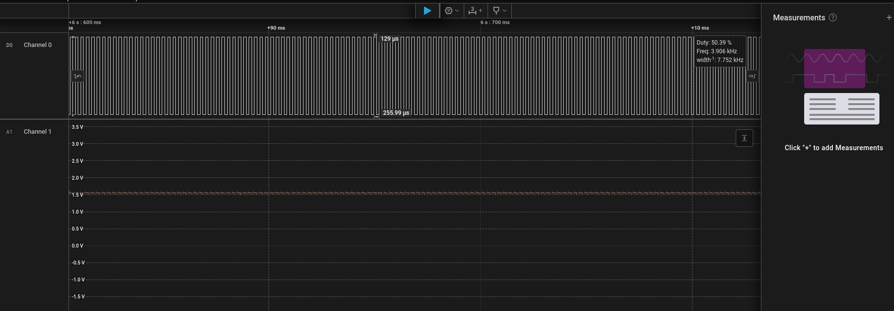

## Blinky
### Overview
This project blinks the USR-LED connected to pin PC13 at a frequency of 1 Hz. The purpose of this simple project was to familiarize myself with the IDE and hardware.

### Software
Saleae Logic 2 software used.

### Hardware
Logic analyzer used to verify frequency.

### Images
Below are images of the project setup and frequency verification.

Setup: 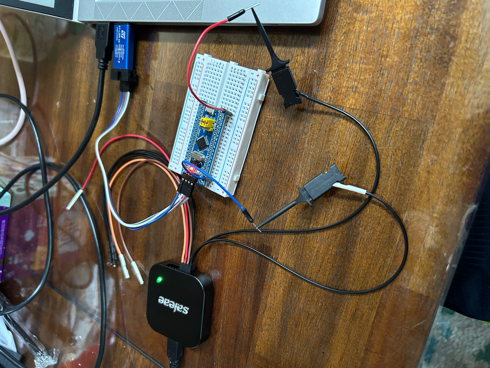

Frequency Verification: 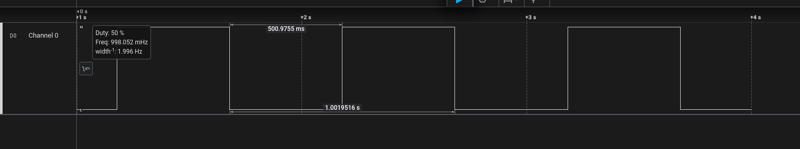

## Crystal-LCD
### Overview
This project prints two lines of text to a 1602-LCD via I2C communication Protocol.
The process begins by initializing the display in accordance with the [manual](https://cdn-shop.adafruit.com/datasheets/TC1602A-01T.pdf). The program then prints two strings to the display, one string per line. 
To accommodate the I2C interface for the LCD, each byte of data is sent 4 bits at a time. This requires bit manipulation in the lcd_send_cmd_hi2cx and lcd_send_data_hi2cx functions.

### Software
Saleae Logic 2 software used.

### Hardware
Logic analyzer used to verify communication.

### I2C Setup
- Address length = 7-bit
- Default settings for all other options

### Schematic

Schematic: 

### Images

Setup: 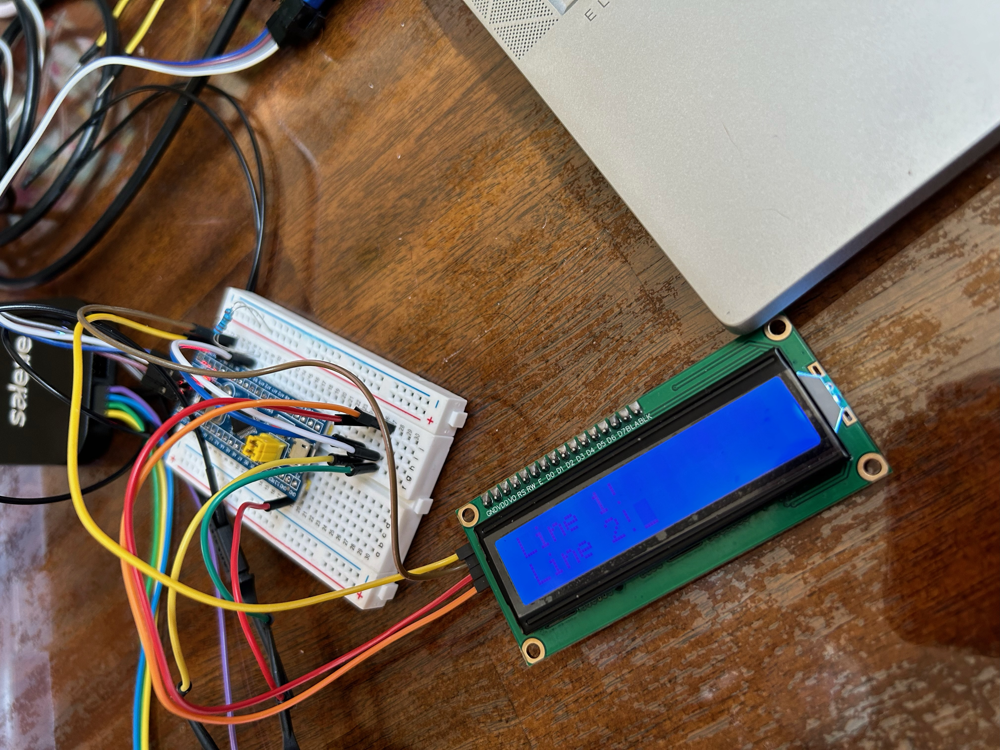

Initial Initialization Command: 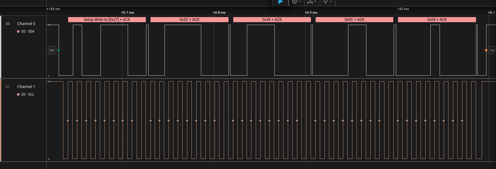

Sending 'L' Character: 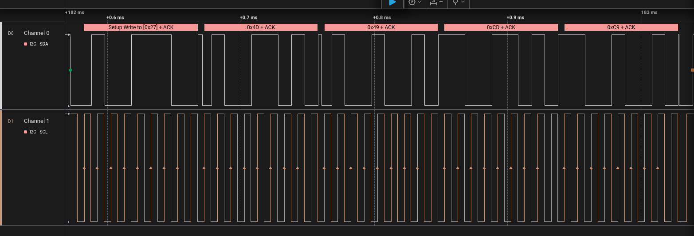

## FreeRTOS-Blinky
### Overview 
The purpose of this project is to practice creating and terminating tasks. 
This project begins by creating three tasks. BlueBlinkTask is responsible for blinking the Blue LED at a frequency of 2.5 Hz. GreenBlinkTask is responsible for blinking the Green LED at a frequency of approximately 0.83 Hz. RedBlinkTask has two responsibilities. The first responsibility is to terminate the the other two tasks after a delay of 2.4 seconds. The task then blinks the red LED at a frequency of 1 Hz.

### Software
Saleae Logic 2 software used.

### Hardware
Logic analyzer used to verify frequencies and order of events.

### CMSIS Setup
- Default settings for all options.

### Schematic

Schematic: 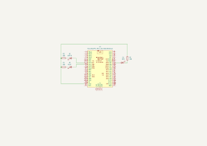

### Images

Setup: 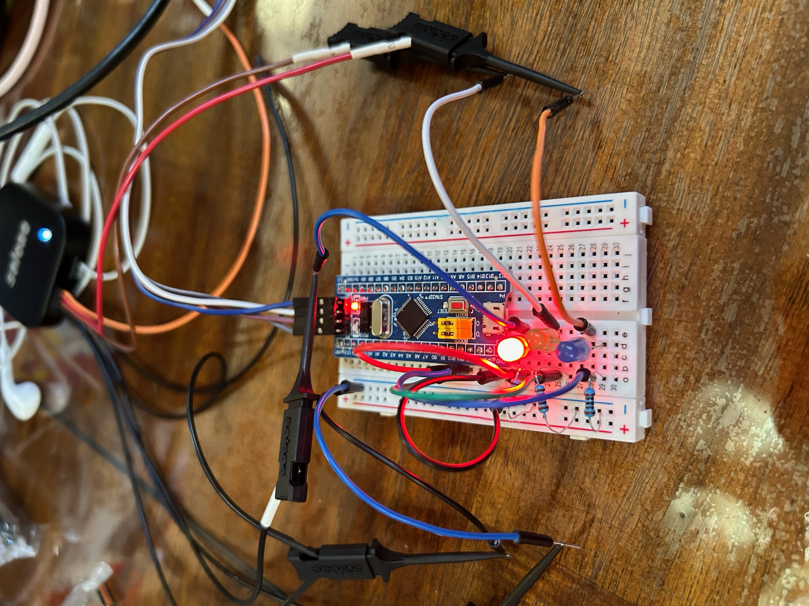

Order and Frequency Verification. Channels 0, 1, and 2 correspond to the red, green and blue LED's respectively: 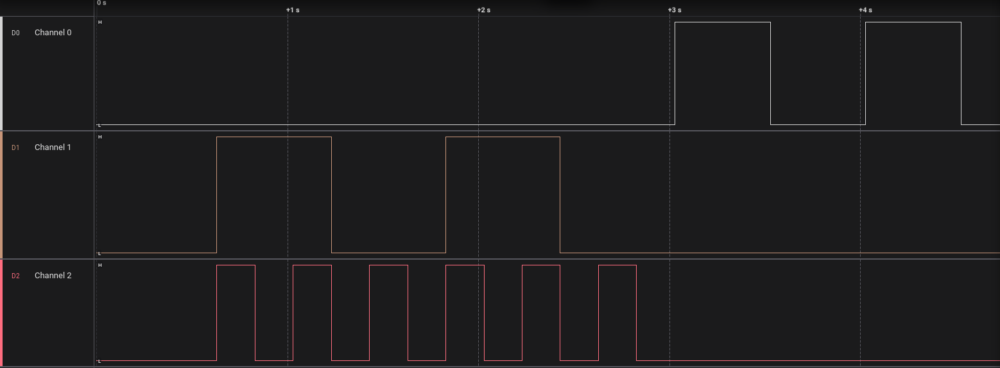